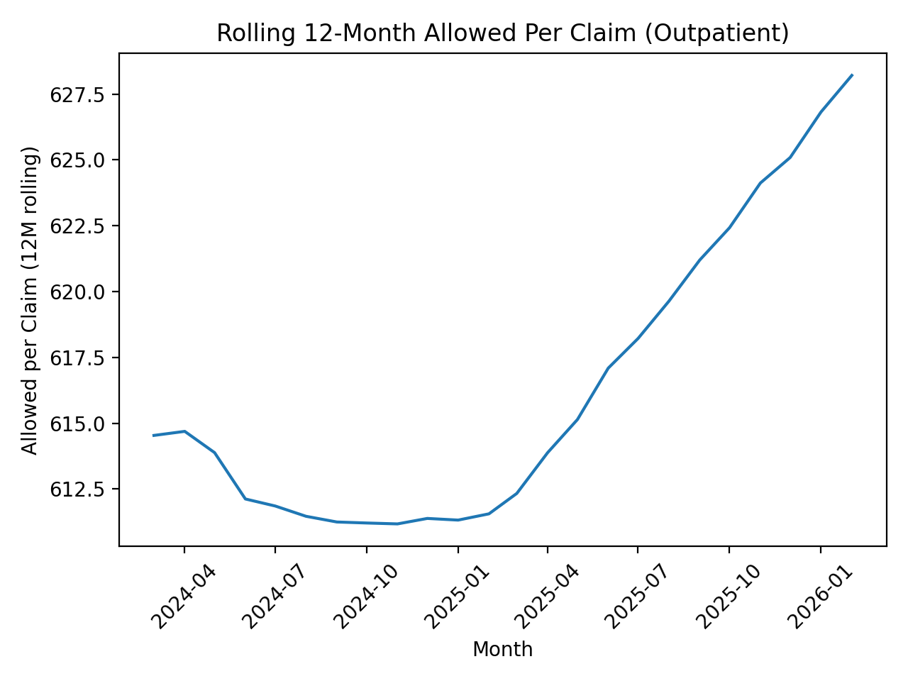
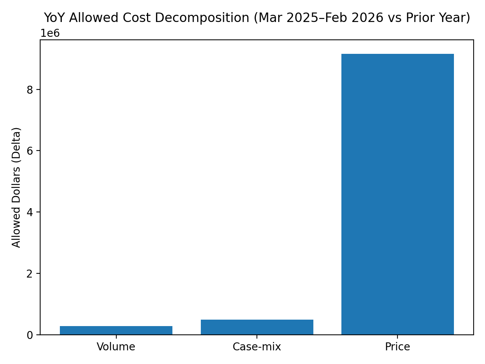
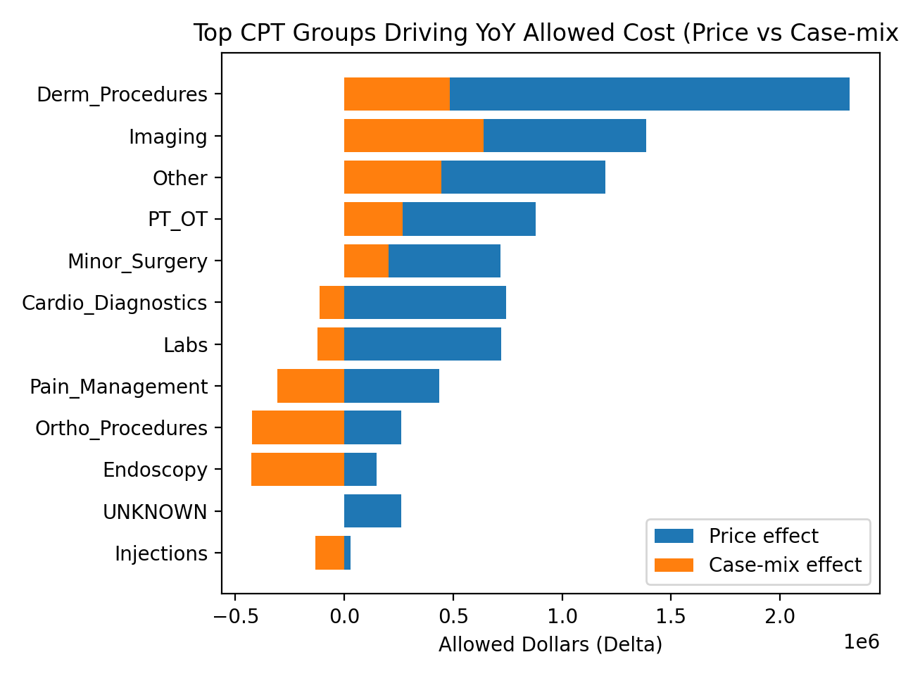
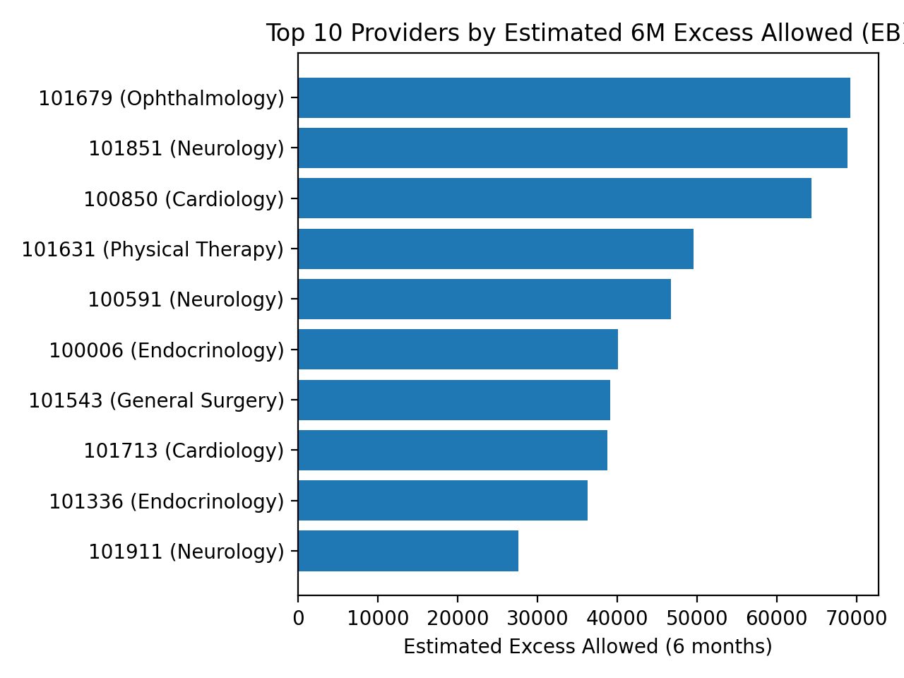
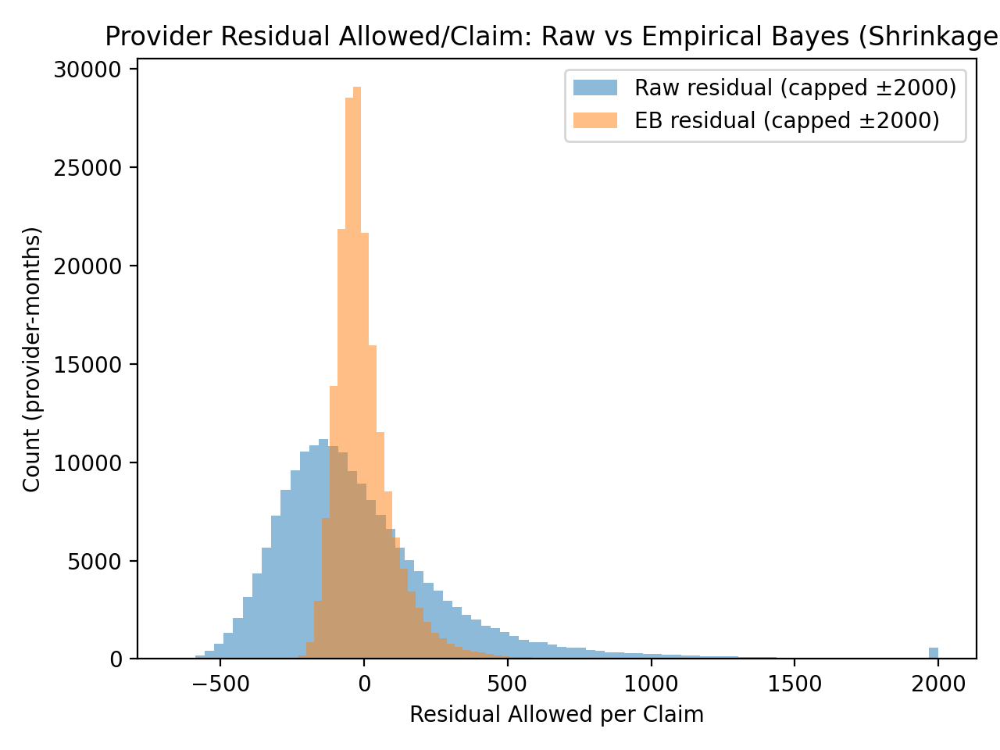

# Healthcare Claims Leakage Analytics
Cost Decomposition, Provider Benchmarking & Empirical Bayes Risk Adjustment
## Overview
This project implements a full healthcare analytics pipeline to identify outpatient cost leakage using SQL‑based benchmarking, statistical decomposition, and Empirical Bayes shrinkage.
Using 1.2M synthetic claims stored in PostgreSQL, the workflow:
- Quantifies rolling cost trends
- Decomposes year‑over‑year spend into volume, case‑mix, and price effects
- Benchmarks providers against peer groups
- Applies Empirical Bayes shrinkage to stabilize noisy residuals
- Produces an audit‑ready shortlist of potential outlier providers

## Key Results

---

### 1. Rolling 12-Month Allowed per Claim



Allowed per claim shows sustained inflation while claim volume remains relatively stable.

---

### 2. Year-over-Year Cost Decomposition



Mar 2025–Feb 2026 vs prior 12 months:

- Total increase: +$9.93M  
- Volume effect: +$0.29M  
- Case-mix effect: +$0.49M  
- Price effect: +$9.16M  

Conclusion: Cost growth is overwhelmingly price-driven.

---

### 3. CPT Group Contribution (Price vs Case Mix)



Largest price-driven categories:

- Dermatology Procedures  
- Imaging  
- PT/OT  
- Minor Surgery  

---

### 4. Top Providers by Estimated Excess Allowed (Empirical Bayes Adjusted)



Top providers demonstrate:

- Sustained high EB percentile months  
- Credibility weights between 0.36–0.39  
- Estimated 6-month excess between $36K–$69K  

---

### 5. Raw vs Empirical Bayes Residual Distribution



Shrinkage reduces heavy tails and stabilizes outlier detection.
## Methodology
Provider Grouping
Providers are benchmarked within peer groups defined by:
- Specialty
- Place of Service
- County
Residual Calculation
\mathrm{Residual}=\mathrm{provider\_ allowed\_ per\_ claim}-\mathrm{peer\_ allowed\_ per\_ claim}
Empirical Bayes Adjustment
\mathrm{EB\  Residual}=w\times \mathrm{Residual}
Where w is the credibility weight based on provider volume and peer variance.
Flagging Criteria
A provider is flagged if:
- ≥ 2 high EB percentile months
- ≥ 150 claims in 6 months
- ≥ 4 months observed

```text
claims-leakage/
├── sql/
├── src/
├── reports/
│   └── figures/
├── data/
└── README.md


Author
Tarak Ram Donepudi
MS Computer Science
